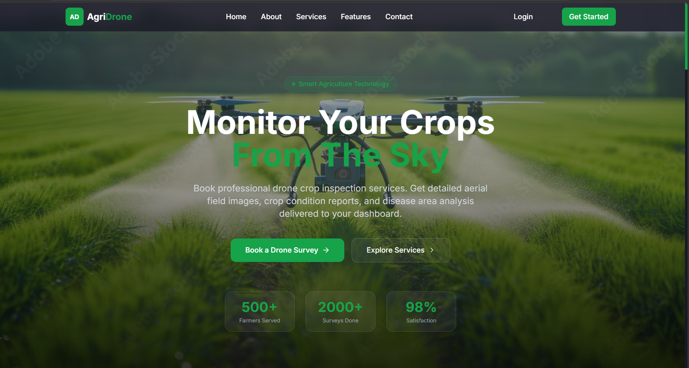
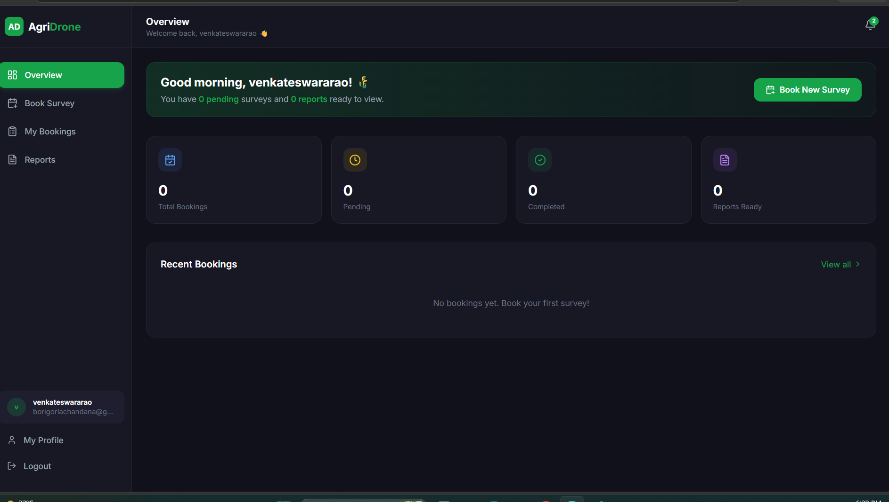
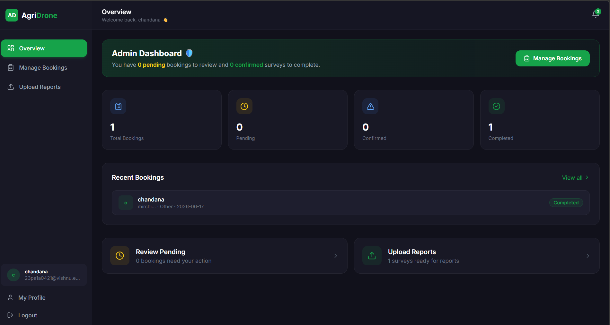

# 🌾 AgriDrone — Crop Monitoring Platform

A full-stack drone crop monitoring and booking platform for farmers and admins.

 Live Demo: https://agridrone-client-git-main-chandana-99-borigorlas-projects.vercel.app

---

### Landing Page

### Farmer Dashboard

### Admin Dashboard

---

##  Tech Stack

-Frontend — React, Vite, Tailwind CSS, Framer Motion
- Backend — Node.js, Express
- Database — MongoDB Atlas
- Auth — JWT
- Storage — Cloudinary
- Email — Nodemailer

---

##  Features

- Farmer can book drone surveys and view crop reports
- Admin can manage bookings and upload reports with images
- Forgot/Reset password via email
- Protected routes with JWT auth

---

##  Deployment

- Frontend → Vercel
- Backend → Render
- Database → MongoDB Atlas

